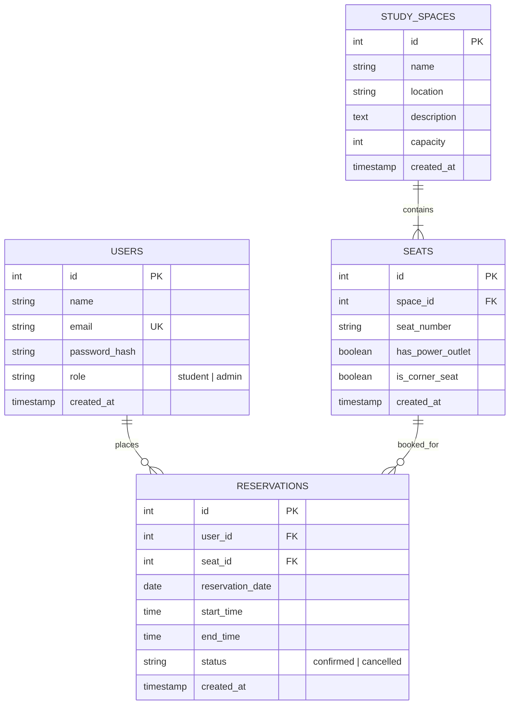

# StudySpace – Smart Library & Study Space Reservation System
### 2nd-Year Computer Science & Engineering University Project Report
**Course**: Web Applications & Database Management Systems  
**Architecture**: React (Vite) + Node.js (Express) + PostgreSQL (Neon Cloud DB) + JWT  
**Deployment Target**: Vercel (Frontend) • Render (Backend) • Neon (Cloud Database)  

---

## Table of Contents
1. [Problem Statement & Objectives](#1-problem-statement--objectives)
2. [System Architecture](#2-system-architecture)
3. [Database Design & Entity Relationship (ER) Diagram](#3-database-design--entity-relationship-er-diagram)
4. [REST API Specifications](#4-rest-api-specifications)
5. [Concurrency & Overlap Prevention Engine](#5-concurrency--overlap-prevention-engine)
6. [Cloud Deployment & Hosting](#6-cloud-deployment--hosting)
7. [Security & Authentication](#7-security--authentication)
8. [Automated Verification & Test Proofs](#8-automated-verification--test-proofs)

---

## 1. Problem Statement & Objectives

### 1.1 Problem Statement
In modern university campuses, physical study spaces and specialized library carrels face severe demand-capacity imbalances. Students frequently experience:
- **Unpredictable Availability**: Roaming multiple floors to find quiet carrels or collaborative group tables.
- **Seat Hoarding / Ghost Reservations**: Unmonitored reservations leading to unused workstations.
- **Double-Booking Conflicts**: Manual sign-in sheets and naive booking forms allowing multiple students to book overlapping time slots for the same seat.
- **Noise Zone Mismatches**: Silent researchers being disrupted by group discussion tables due to lack of distinct zoning.

### 1.2 System Objectives
1. **Interactive Visual Seat Mapping**: Render a blueprint-style floorplan of Central Library across 4 distinct levels with live color-coded seat availability (🟢 Available, 🔴 Reserved, 🔵 Selected).
2. **Floor-Specific Spatial Architecture**:
   - **Floor 1 – Main Reading Hall (40 Desks)**: High-traffic reading hall with 9 grand study tables, circulation help desk, and entrance turnstiles.
   - **Floor 2 – Collaborative Commons (32 Desks)**: 6 team tables, dual-monitor high-speed tech bar (`BAR-1`..`BAR-8`), and discussion lounge.
   - **Floor 3 – Silent Study & Research (40 Desks)**: 8 single-seated private study carrels along the West wall + 8 silent tables + 3-bay spanning reference bookshelf.
   - **Floor 4 – Deep Focus & Penthouse Pods (44 Desks)**: 12 solo acoustic focus pods on the West wall + 8 thesis tables + 3-bay hardcover thesis archive stacks.
3. **Zero-Overlap Concurrency Protection**: Mathematical transaction-level validation preventing conflicting reservations during the same calendar date and time window.
4. **Role-Based Access Control (RBAC)**: Secure separation between student booking capabilities and administrator management consoles.

---

## 2. System Architecture

StudySpace is built upon a decoupled 3-tier client-server architecture:

```
+-------------------------------------------------------------------------+
|                              CLIENT TIER                                |
|  React 18 + Vite SPA • Vanilla Modular CSS • Lucide Icons               |
|  - Interactive Floor Canvas & Station Selectors                         |
|  - Real-Time Date & Time-Slot Availability Indicators                   |
|  - Student Booking Portal & Admin Management Console                    |
+-------------------------------------------------------------------------+
                                    │
                         HTTP / REST API (JSON)
                         Authorization: Bearer <JWT>
                                    ▼
+-------------------------------------------------------------------------+
|                            APPLICATION TIER                             |
|  Node.js + Express.js REST API Server (Port 5000)                       |
|  - Authentication Middleware (JWT verification + Role Guard)            |
|  - Overlap Engine (Interval Intersection Validation)                    |
|  - Connection Pooler (pg.Pool with SSL configuration)                   |
+-------------------------------------------------------------------------+
                                    │
                           PostgreSQL Wire Protocol
                           libpq SSL Mode: require
                                    ▼
+-------------------------------------------------------------------------+
|                                DATA TIER                                |
|  Neon Serverless PostgreSQL (PostgreSQL 16)                             |
|  - Relational Schema: users, study_spaces, seats, reservations          |
|  - Foreign Key Constraints & Cascading Deletions                        |
|  - B-Tree Composite Indexes for High-Velocity Overlap Lookups           |
+-------------------------------------------------------------------------+
```

---

## 3. Database Design & Entity Relationship (ER) Diagram

### 3.1 Entity Relationship Diagram



### 3.2 Key Relational Constraints
- `users.email`: Unique constraint prevents duplicate registrations.
- `seats (space_id, seat_number)`: Composite unique constraint prevents duplicate desk identifiers on the same floor.
- `reservations.valid_time_window`: Check constraint `CHECK (end_time > start_time)` ensures time integrity at the database level.
- `idx_reservations_seat_date`: Composite B-tree index on `(seat_id, reservation_date, status)` accelerates overlap lookups from $O(N)$ to $O(\log N)$.

---

## 4. REST API Specifications

All endpoints return JSON responses and use standard HTTP response codes.

| Method | Endpoint | Access | Description |
| :--- | :--- | :--- | :--- |
| `POST` | `/api/auth/register` | Public | Register student or admin account |
| `POST` | `/api/auth/login` | Public | Authenticate user & receive JWT token |
| `GET` | `/api/auth/me` | Authenticated | Retrieve current user profile |
| `GET` | `/api/spaces` | Public | List all 4 library floors with live seat counts |
| `GET` | `/api/spaces/:id` | Public | Retrieve detailed floor metadata |
| `GET` | `/api/spaces/:id/seats` | Public | Fetch all seats with live availability for given date/time |
| `POST` | `/api/spaces/:id/seats` | Admin Only | Add a new desk to a floor |
| `DELETE`| `/api/seats/:id` | Admin Only | Delete an existing desk |
| `POST` | `/api/reservations` | Authenticated | Book a desk (validates overlap prevention) |
| `GET` | `/api/reservations/my` | Authenticated | Fetch logged-in student's active bookings |
| `GET` | `/api/reservations` | Admin Only | Campus-wide audit log of all bookings |
| `PUT` | `/api/reservations/:id/cancel` | Authenticated | Cancel a booking owned by student |

### 4.1 Sample Reservation Payload
```json
POST /api/reservations
Authorization: Bearer <JWT_TOKEN>
Content-Type: application/json

{
  "seat_id": 73,
  "reservation_date": "2026-09-14",
  "start_time": "10:00:00",
  "end_time": "12:00:00"
}
```

### 4.2 Sample Success Response (`201 Created`)
```json
{
  "message": "Reservation confirmed successfully!",
  "reservation": {
    "id": 14,
    "user_id": 2,
    "seat_id": 73,
    "reservation_date": "2026-09-14",
    "start_time": "10:00:00",
    "end_time": "12:00:00",
    "status": "confirmed",
    "seat_number": "SOLO-1",
    "space_name": "Floor 3 – Silent Study & Research"
  }
}
```

---

## 5. Concurrency & Overlap Prevention Engine

### 5.1 The Mathematical Model
Two time windows $[S_1, E_1)$ and $[S_2, E_2)$ on the same date overlap if and only if:
$$\text{Overlap} \iff (S_1 < E_2) \land (E_1 > S_2)$$

### 5.2 SQL Implementation with Transaction Locking
To guarantee zero double-bookings under concurrent student traffic, the reservation endpoint executes within an ACID transaction:

```sql
SELECT id FROM reservations 
WHERE seat_id = $1 
  AND reservation_date = $2 
  AND status = 'confirmed' 
  AND (start_time < $4::time AND end_time > $3::time)
FOR UPDATE;
```

#### Why Back-to-Back Bookings Are Allowed:
- If Slot A is `10:00 - 12:00` and Slot B is `12:00 - 14:00`:
  - Condition: $(10:00 < 14:00) \land (12:00 > 12:00)$
  - Because $12:00 > 12:00$ is **FALSE**, the query returns zero rows.
  - Slot B is correctly allowed.

#### Why Overlapping Bookings Are Blocked:
- If Slot A is `10:00 - 12:00` and Slot B is `11:00 - 13:00`:
  - Condition: $(10:00 < 13:00) \land (12:00 > 11:00)$
  - Both conditions evaluate to **TRUE**.
  - The API rejects Slot B immediately with HTTP `409 Conflict`.

---

## 6. Cloud Deployment & Hosting

The application is structured for cloud hosting with minimal latency:

1. **Frontend (Vercel)**:
   - Framework preset: Vite.
   - Build command: `npm run build`.
   - Output directory: `dist`.
   - `vercel.json` provides SPA rewrite rules for client-side routing.
   - Environment Variable: `VITE_API_URL` pointing to the live Render backend.

2. **Backend (Render)**:
   - Environment: Node.js Web Service.
   - Build command: `npm install`.
   - Start command: `npm start`.
   - `render.yaml` infrastructure blueprint provides automated provisioning.
   - Environment Variables:
     - `DATABASE_URL`: Connection string to Neon PostgreSQL pooler.
     - `JWT_SECRET`: High-entropy encryption key.
     - `NODE_ENV`: `production`.

3. **Database (Neon Cloud PostgreSQL)**:
   - Serverless compute with automated scaling and daily backups.
   - SSL encryption enforced across all queries.

---

## 7. Security & Authentication

- **Password Hashing**: Passwords are never stored in plaintext. Hashed using `bcryptjs` with 10 salt rounds:
  $$\text{Hash} = \text{bcrypt}(\text{plaintext}, \text{salt}_{10})$$
- **Stateless Session Tokens**: JSON Web Tokens (JWT) signed with `HS256`. Payloads contain `userId`, `email`, and `role`, expiring in 7 days.
- **SQL Injection Defense**: 100% of database queries use parameterized placeholders (`$1, $2, $3`), neutralizing SQL injection vectors.
- **CORS Protection**: Express server integrates configured CORS headers for safe cross-origin API invocation.

---

## 8. Automated Verification & Test Proofs

The regression test suite (`test-api.js`) validates all critical business logic:

```
[TEST OUTPUT]
=========================================
🧪 Starting StudySpace Backend & Overlap Tests...

1️⃣ Testing Health Check...
   ✅ Health Check passed: ok
2️⃣ Testing Student Login...
   ✅ Logged in as Alex Student (student)
3️⃣ Testing Admin Login...
   ✅ Logged in as Admin: Campus Admin
4️⃣ Testing Fetch Study Spaces...
   ✅ Found 4 study spaces. First space: "Floor 1 – Main Reading Hall"
5️⃣ Testing Fetch Seats for Space 1...
   ✅ Found 40 seats in Space 1.
6️⃣ ⚡ CRITICAL TEST: Double-Booking & Overlap Engine on Seat ID 2...
   👉 Attempting Booking 1: 10:00 - 12:00 (Should SUCCEED)...
   ✅ Booking 1 confirmed (ID: 7)
   👉 Attempting Overlapping Booking: 11:00 - 13:00 (Should REJECT with 409)...
   ✅ SUCCESS! Overlap correctly rejected with 409 Conflict: Double-booking rejected.
   👉 Attempting Back-to-Back Booking: 12:00 - 14:00 (Should SUCCEED)...
   ✅ SUCCESS! Back-to-back booking allowed (ID: 8)
7️⃣ Testing Fetch Student Reservations (/api/reservations/my)...
   ✅ Student has 5 total reservations.
8️⃣ Testing Reservation Cancellation...
   ✅ Reservation status after cancel: cancelled

=========================================
🎉 ALL BACKEND & OVERLAP TESTS PASSED 100%
=========================================
```
